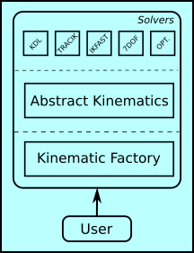

kinematics_library
=============

A framework for handling serial robot kinematics. This framework contains state of the art kinematic solvers
such as kdl, ikfast, trac_ik, etc.. The aim of this framework is to offer the user different kinematic solvers by just changing the 
configuration.

This framework offers the following kinematics solvers to solve both forward and inverse kinematics.
- [KDL](https://www.orocos.org/wiki/Kinematic_and_Dynamic_Solvers.html) : Use Orocos Kinematics and Dynamics library to solve the kinematic problem.
- [TRACIK](https://bitbucket.org/traclabs/trac_ik/src/master/): Tracik offers a better and faster solution compared to KDL. This solver combines KDL and optimization-based solver to solve the kinematics problem.
    - If you want to use trac_ik solver, please install the [tracik library](https://bitbucket.org/traclabs/trac_ik/src/master/) 
      before building this library.        
- [IKFAST](http://openrave.org/docs/0.8.2/openravepy/ikfast/): ikfast is an analytical kinematic solver for non-redundant robots.
    - The user needs to provide a "ikfast_generated.so" of the robot.
- 7DOF Analytical solvers: There are two different methods to analytically solve the inverse kinematic for a 7DOF arm. But the manipulator needs to follow a certain structure.
    - [IK7DOF: shimizu_method](https://ieeexplore.ieee.org/document/4631505) - SRS (Spherical - revolute - Spherical joints)
    - [SRS: asfour_method](https://ieeexplore.ieee.org/document/1248841)  - SRS (Spherical - revolute - Spherical joints)
- OPT: Optimization-based solver
    - Please install [NLOPT](https://nlopt.readthedocs.io/en/latest/) in order to use this solver.
    - The inverse kinematic problem is formualted as a wieghted sum optimization problem. 
    - Currently position, orientation, velocity, and acceleration erms are optimized. The user can able to set the weight for
      the objective funtions.
    - The forward kinematics is solved using the KDL library.

